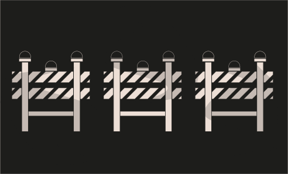

# Challenge 14



```solidity
// SPDX-License-Identifier: MIT
pragma solidity ^0.8.0;

contract GatekeeperTwo {

  address public entrant;

  modifier gateOne() {
    require(msg.sender != tx.origin);
    _;
  }

  modifier gateTwo() {
    uint x;
    assembly { x := extcodesize(caller()) }
    require(x == 0);
    _;
  }

  modifier gateThree(bytes8 _gateKey) {
    require(uint64(bytes8(keccak256(abi.encodePacked(msg.sender)))) ^ uint64(_gateKey) == type(uint64).max);
    _;
  }

  function enter(bytes8 _gateKey) public gateOne gateTwo gateThree(_gateKey) returns (bool) {
    entrant = tx.origin;
    return true;
  }
}
```

Challenge
---
> This gatekeeper introduces a few new challenges. Register as an entrant to pass this level.

Solution
---

1. Let's See Same as the GateKeeperOne but few minor changes.

Part 1
---
1. We have pass first three modifier let's see `gateOne` modifier

```solidity
  modifier gateOne() {
    require(msg.sender != tx.origin);
    _;
  }
```

same as the last one.

Part 2
---
```solidity
  modifier gateTwo() {
    uint x;
    assembly { x := extcodesize(caller()) }
    require(x == 0);
    _;
  }
```
Few New things assembly is used for the when you want to write yul code in solidity. Here `extcodesize` is to verify whether a call was made from an externally owned account (EOA) or a contract account. and caller() means caller of the function. then if it is contrtact account it will revert otherwise pass the check.

Part 3
---
```solidity
 modifier gateThree(bytes8 _gateKey) {
    require(uint64(bytes8(keccak256(abi.encodePacked(msg.sender)))) ^ uint64(_gateKey) == type(uint64).max);
    _;
  }
```

From the [Solidity documentation](https://docs.soliditylang.org/en/latest/units-and-global-variables.html#type-information)

  - `type(X)` returns information about `X` type.
  
  >     
     **Followings are the represention of interger Type T**

        - `type(T).min` The smallest value representable by type T.
        - `type(T).max` The largest value representable by type T.
  
Max Number of `type(uint64).max` is `18446744073709551615` you can get this value by `2 ** 64 - 1` (eg. `2 ** N - 1`) where n is the `number of bits`.

 - XOR Operation 
  | A |  B  | XOR |
|:-----|:--------:|------:|
| 0  | 0 | 0 |
| 0   |  1  |  1 |
| 1   | 0 |   1 |
| 1   | 1 |   0 |

If the both the A and B are same then `true (1)` otherwise `false (0)`. 

```solidity
// SPDX-License-Identifier: MIT
pragma solidity ^0.8.0;

contract GatekeeperTwoAttack {
    // Remember a contract does not have source code available during construction. so the size of the code is 0.
    constructor()  {
        GatekeeperTwo gatekeeperTwoAddress = GatekeeperTwo(YOUR_INSTANCE_ADDRESS);
        bytes8 _gateKey = bytes8(uint64(bytes8(keccak256(abi.encodePacked(address(this))))) ^ type(uint64).max);
        gatekeeperTwoAddress.enter(_gateKey);
    }
  
}

```

Here's the full code we can only pass this challenge when our contract size is zero and `msg.sender ^ _gateKey` must be equal to `type(uint64).max`. now submit the instance your challenge will be cleared.